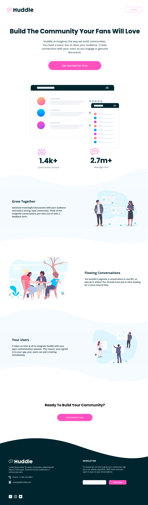

# Proyecto: Huddle Landing Page

## Descripción

El proyecto **Huddle Landing Page** es una solución de el [desafío de la página de inicio con secciones curvas en Frontend Mentor](https://www.frontendmentor.io/challenges/huddle-landing-page-with-curved-sections-5ca5ecd01e82137ec91a50f2). El objetivo es crear una un página responsiva que cumpla con los requisitos del desafío de Frontend Mentor. Para ello, el proyecto utilizará las tecnologías de HTML y SASS, siguiendo la metodología BEM para el nombramiento de clases y el flujo de trabajo "desktop first".

## Índice

- [Requerimientos](#requerimientos)
- [Despliegue](#despliegue)
- [Capturas de pantalla](#capturas-de-pantalla)
- [Comensando](#comensando)
- [Construido con](#construido-con)
- [Lecciones aprendidas](#lecciones-aprendidas)
  - [Worflow](#enfoques-en-el-diseño-y-desarrollo-de-sitios-web-workflow)
  - [Metodología BEM](#metodología-bem)
  - [Tamaño de pantallas](#tamaño-de-pantallas)
  - [Mixin e include](#mixin-e-iclude)
- [Documentos Recursos](#documentos-recursos)
- [Concluisiones](#conclusiones)
- [Mejoras](#mejoras)
- [Recomendaciones](#recomendaciones)
- [Hecho por](#hecho-por)

## Requerimientos

- [x] Los usuarios deberán poder ver el diseño óptimo para el sitio según el tamaño de sus pantalla (desktop: 1440px y mobile: 375px).
- [x] Ver los estados de desplazamiento para todos los elementos interactivos.
- [x] La landing page debe estar desplegado en Vercel
- [x] Se utilizará un repositorio de GitHub
- [X] La Landing page debe utilzar HTML
- [x] Utilizar SASS como preprocesador de CSS.
- [x] Las clases deberán estár nombradas utilizando la metodología BEM.
- [x] El flujo de trabajado debe ser "desktop first".

## Despliegue

- [Link en Vercel](https://huddle-landing-page-phi-steel.vercel.app/)
- [Link en GitHub](https://github.com/WFernandoc07/fronted-exercises/tree/main/01-huddle-landing-page-curved)

## Capturas de pantalla

| Desktop                                                                                         | Mobile                                                                                             |
| ----------------------------------------------------------------------------------------------- | -------------------------------------------------------------------------------------------------- |
|  |  |

## Comensando

1. Se debe tener instalado node.js y el gestor de librería npm.
2. [Instalar SASS](https://sass-lang.com/install/)

```bash
npm install -g sass
```

3. Ejecutar el comando para convertir de SASS a CSS.

```bash
sass sass/styles.scss css/styles.css
```

4. Ejecutar el comando que permite visualizar en tiempo real los cambios.

```bash
sass styles/sass/main.scss styles/css/main.css --watch
```

## Construido con
- HTML
- CSS
- SASS
- Desktop-first workflow
- Git
- GitHub

## Lecciones aprendidas

### Enfoques en el diseño y desarrollo de sitios web (workflow)

#### Mobile First

Se inician por estructurar la información y las caraterísticas más importantes para dispositivos móviles, luego estas se irán adaptando para pantallas más grandes.

#### Desktop First

Se inician por estructurar la información y las características más importantes para dispositivos de escritorio, luego estas se irán adaptando para pantallas más pequeñas.

### Metodología BEM

- **Bloques:** Encapsula una entidad que tienes significado por si sola. Semánticamente son iguales, no hay precedencia ni jerarquian. Entidades holísticas sin representación DOM(como controladores o modelos) pueden ser bloques.

```scss
.block {
  color: #fff;
}
```

- **Elementos:** Partes de un bloque y no tienen significado independiente, un elemento se vincula semanticamente a su bloque.

```scss
.block__elem {
  color: #fff;
}
```

- **Modificadores:** Se usan para cambiar la apariencia, el comportamiento o el estado. El nombre se forma por el nombre del bloque o elemento más dos guiones.

```html
<div class="block block--mod">...</div>
<div class="block block--size-big block--shadow-yes">...</div>
```

- **Ejemplos:**

```css
.block {
}
.block__elem1 {
}
.block__elem2 {
}
.block__elem3 {
}
```

```html
<div class="block">
  <div class="block__elem1">
    <div class="block__elem2">
      <div class="block__elem3"></div>
    </div>
  </div>
</div>
```

```html
<div class="block">
  <div class="block__elem1">
    <div class="block__elem2"></div>
  </div>
  <div class="block__elem3"></div>
</div>
```

### Tamaño de pantallas

- **375px -> Pantallas xsm: (celulares)**
- 576px -> pantallas sm (celulares)
- 768px -> pantallas md (tablets y ceulares)
- 992px -> pantallas ld (Desktop)
- 1200px -> pantallas xl (Desktops, TVs)
- **1440px -> Pantallas xxl (Desktop, TVs)**

### Mixin e include

Un mixin es una función que puede o no incluir parámetros, que nos permiten reutilizar código, a través del include.

- **Mixin sin argumentos**

```scss
@mixin reset-list {
  margin: 0;
  padding: 0;
  list-style: none;
}

@mixin horizontal-list {
  @include reset-list;

  li {
    display: inline-block;
    margin: {
      left: -2px;
      right: 2em;
    }
  }
}

nav ul {
  @include horizontal-list;
}
```

- **Mixin con argumentos**

```scss
@mixin rtl($property, $ltr-value, $rtl-value) {
  #{$property}: $ltr-value;

  [dir="rtl"] & {
    #{$property}: $rtl-value;
  }
}

.sidebar {
  @include rtl(float, left, right);
}
```

## Documentos recursos

- [Metodología BEM](https://getbem.com/)
- [css-color-filter-generator](https://angel-rs.github.io/css-color-filter-generator/)
- [colorhunt.co](https://colorhunt.co/)
- [SASS Sonahang Rai Blog, Responsive web Design with SASS](https://www.sonahangrai.com/tutorials/responsive-web-design-with-sass/)
- [@mixin and @include](https://sass-lang.com/documentation/at-rules/mixin/)

## Conclusiones
El proyecto Huddle Landing Page es una solución completa del desafío de Frontend Mentor de crear una página de inicio con secciones curvas. El proyecto cumple con todos los requisitos del desafío y utiliza las tecnologías y metodologías recomendadas.

## Mejoras
Para mejorar el proyecto, se podrían realizar las siguientes mejoras:

* Añadir más contenido a la sección de cuerpo, como imágenes, vídeos o texto adicional.
* Añadir más interactividad a la página, como animaciones o efectos.
* Añadir pruebas unitarias para garantizar el correcto funcionamiento del proyecto.

## Recomendaciones
El proyecto Huddle Landing Page es una buena solución para aprender a crear páginas de inicio responsivas utilizando HTML y SCSS. El proyecto sigue las mejores prácticas y utiliza las tecnologías y metodologías recomendadas.

## Hecho por

- LinkedIn - [William Castrejón](https://www.linkedin.com/in/wfernandoc07/)
- GitHub - [WFernandocO7](https://github.com/WFernandoc07)
