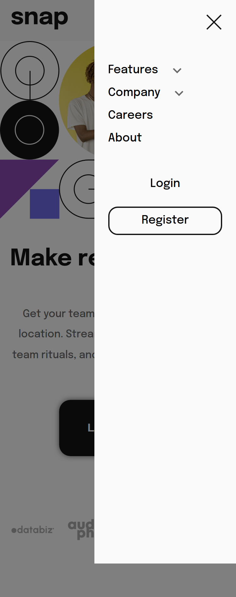

# Proyecto: Section with dropdown navigation

## Descripción

El proyecto Section with Dropdown Navigation es una solución de el desafío de [Intro section With Dropdown Navigation](https://www.frontendmentor.io/challenges/intro-section-with-dropdown-navigation-ryaPetHE5) en Frontend Mentor. El objetivo es crear una un página web responsiva con menús desplegables que cumpla con los requisitos del desafío de Frontend Mentor. Para ello, el proyecto utilizará las tecnologías de HTML, SASS y Javascript, siguiendo la metodología BEM para el nombramiento de clases y el flujo de trabajo "desktop first".

## Índice

## Requerimientos

- [x] Ver los menús desplegables relevantes en computadoras de escritorio y dispositivos móviles al interactuar con los enlaces de navegación.
- [x] Ver el diseño óptimo para el contenido según el tamaño de pantalla de su dispositivo.
- [x] Ver estados de desplazamiento para todos los elementos interactivos en la página.
- [x] La página debe estar desplegado en Vercel.
- [x] Se utilizará un repositorio de GitHub.
- [x] Se gestionará las versiones con GIT.
- [x] La página debe utilzar HTML.
- [x] Utilizar SASS como preprocesador de CSS.
- [x] Utilizar Javascript para lograr los menús desplegables.
- [x] Las clases deberán estár nombradas utilizando la metodología BEM.
- [x] El flujo de trabajado debe ser "mobile first".

## Despliegue

- [Link en Vercel](https://wf-dropdown-navigation.vercel.app/)
- [Link en GitHub](https://github.com/WFernandoc07/fronted-exercises/tree/main/02-dropdown-navigation-main)

## Capturas de pantalla

| Desktop                                                        | Mobile                                                        |
| -------------------------------------------------------------- | ------------------------------------------------------------- |
|  |  |

## Comensando

1. Se debe tener instalado node.js y el gestor de librería npm.
2. [Instalar SASS](https://sass-lang.com/install/)

```zsh
npm install -g sass
```

3. Ejecutar el comando para convertir de SASS a CSS.

```zsh
sass styles/scss/main.scss styles/css/main.css
```

4. Ejecutar el comando que permite visualizar en tiempo real los cambios.

```zsh
sass styles/scss/main.scss styles/css/main.css --watch
```
## Construido con
- HTML
- CSS
- SASS
- Javascript
- Vercel (Para el despliegue)
- Mobile-first workflow (Flujo de Tabajo)
- Metedología BEM (Para el nombramiento de clases)
- Git
- GitHub


## Lecciones aprendidas

### Funciones Multimedia

* min-width (tamaño de pantalla mínimo)
* max-widt (tamaño de pantall máximo)

* **Rotacion de pantallas**
  * Portratir (vertical)
  * Landscape (Horizontal)

### **Document.querySelector()**
* **Descripción:** Devuelve el elemento que coincida con el grupo especificado de selectores.
* **Sintaxis**
```js
element = document.querySelector(selectores);
```
* * Donde:
    *  *element*, obeto de tipo element
    * *selectores*, cadena de caracteres con uno o más selectores.

* **Ejemplo:**

```html
<div id="foo\bar"></div>
<div id="foo:bar"></div>

<script>
  console.log("#foo\bar"); // "#fooar"
  document.querySelector("#foo\bar"); // No coincide con nada

  console.log("#foo\\bar"); // "#foo\bar"
  console.log("#foo\\\\bar"); // "#foo\\bar"
  document.querySelector("#foo\\\\bar"); // Coincide con el primer div

  document.querySelector("#foo:bar"); // No coincide con nada
  document.querySelector("#foo\\:bar"); // Coincide con el segundo div
</script>
```

* **Documentación**
  * [https://developer.mozilla.org/es/docs/Web/API/Document/querySelector](https://developer.mozilla.org/es/docs/Web/API/Document/querySelector)


### element.aadEventListener
* **Descripción:** Registra un evento a un objeto en específico.

* **Sintaxis:**
```js
target.addEventListener(tipo, listener[, useCapture]);
```

* **Ejemplo**
```html
<!doctype html>
<html>
  <head>
    <title>DOM Event Example</title>

    <style>
      #t {
        border: 1px solid red;
      }
      #t1 {
        background-color: pink;
      }
    </style>

    <script>
      // Function to change the content of t2
      function modifyText() {
        var t2 = document.getElementById("t2");
        t2.firstChild.nodeValue = "three";
      }

      // Function to add event listener to t
      function load() {
        var el = document.getElementById("t");
        el.addEventListener("click", modifyText, false);
      }

      document.addEventListener("DOMContentLoaded", load, false);
    </script>
  </head>
  <body>
    <table id="t">
      <tr>
        <td id="t1">one</td>
      </tr>
      <tr>
        <td id="t2">two</td>
      </tr>
    </table>
  </body>
</html>
```
* **Documentación**
[https://developer.mozilla.org/es/docs/Web/API/EventTarget/addEventListener](https://developer.mozilla.org/es/docs/Web/API/EventTarget/addEventListener)


## Documentos Recursos

* [Document.querySelector()](https://developer.mozilla.org/es/docs/Web/API/Document/querySelector)
* [Element.addEventListner()](https://developer.mozilla.org/es/docs/Web/API/EventTarget/addEventListener)

## Conclusiones

El proyecto Section with dropdown navigation es una solución completa del desafío de Frontend Mentor de crear una página de inicio con secciones menu desplegable. El proyecto cumple con todos los requisitos del desafío y utiliza las tecnologías y metodologías recomendadas.

## Mejoras

Para mejorar el proyecto, se podrían realizar las siguientes mejoras:

- Añadir más contenido a la sección de cuerpo, como imágenes, vídeos o texto adicional.
- Añadir más interactividad a la página, como animaciones o efectos.
- Añadir pruebas unitarias para garantizar el correcto funcionamiento del proyecto.

## Recomendaciones

El proyecto Section with dropdown navigatione es una buena solución para aprender a crear páginas de inicio responsivas con menú desplegable utilizando HTML, SCSS y Javascript. El proyecto sigue las mejores prácticas y utiliza las tecnologías y metodologías recomendadas.

## Hecho por
- LinkedIn - [William Castrejón](https://www.linkedin.com/in/wfernandoc07/)
- GitHub - [WFernandocO7](https://github.com/WFernandoc07)
